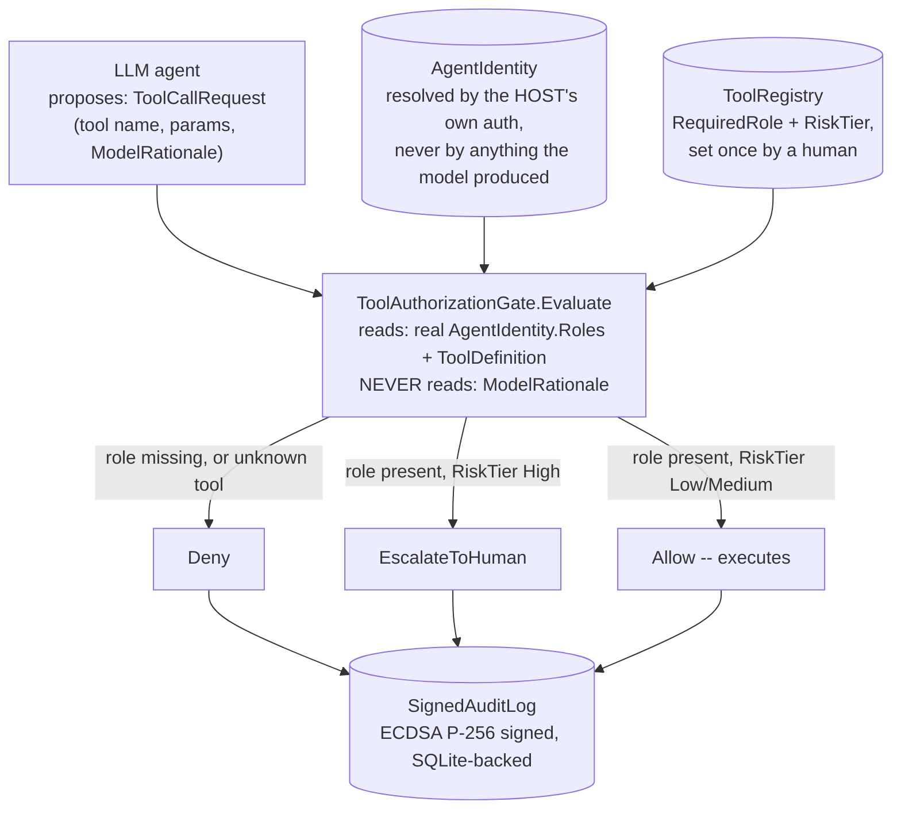

# Secure LLM Gateway

A .NET pre-action authorization gateway for a fictional retail-banking
LLM agent: every tool call an agent proposes is intercepted before it
executes, checked against the caller's REAL, authenticated role set (not
anything the model itself asserts), and permanently recorded in a
cryptographically signed, independently verifiable audit log. Built as
the practical half of the companion
[LLMs in Banking: Secure Architecture field guide](../llm-banking-security-field-guide.html)
(Tier 6) -- specifically, Section 03's argument that an LLM agent's
authority has to be checked against who is really asking, never against
what the model's own output claims.

## Problem

An LLM agent wired to banking tools is, by default, a confused deputy: it
holds credentials to act, and it decides which tool to call based on
context that can include text an attacker planted somewhere the agent
was going to read anyway -- a retrieved support document, a customer
message, a webpage. Simon Willison's framing (cited in the field guide's
Section 01) is the sharpest version of the problem: an LLM "will trust
anything that can send it convincing sounding tokens." A system prompt
telling the model "never transfer funds without confirmation" occupies
the exact same context window a hostile document can also write into --
it is not a security boundary, it's more text for the model to weigh
against whatever else got shoved into that window. This repo builds the
actual boundary: code that decides authorization from the real identity
alone, positioned so that nothing the model produces -- including its
own stated justification for calling a tool -- can reach the decision at
all.

## Architecture



`SecureLlmGateway.Domain` holds the plain records (`AgentIdentity`,
`ToolDefinition`, `ToolCallRequest`, `ToolCallVerdict`,
`SignedAuditRecord`). `SecureLlmGateway.Core` holds the two things that
matter: `ToolAuthorizationGate` (the enforcement point) and
`SignedAuditLog` (the permanent, verifiable record of every decision it
made). `SecureLlmGateway.Demo` walks through five scenarios, two of them
deliberate attacks.

## Decisions and trade-offs

**`ModelRationale` exists on `ToolCallRequest`, and `ToolAuthorizationGate.Evaluate`
never reads it.** This is the single decision the rest of the repo is
built around. The field is there because a human reviewing the audit
trail later should be able to see what the model claimed when it
proposed a given action -- that's real, useful forensic information. But
letting the authorization decision itself be influenced by that text
even slightly (a denylist of "suspicious-sounding" phrases, a lower bar
for a rationale that mentions a specific approver) reopens the exact
hole the field guide's Section 01 describes: an indirect prompt
injection can make the model assert anything, so a decision that reads
the assertion is a decision an attacker can eventually shape. See
`verification/authorization_gate_oracle.py` for a fuzz test proving this
holds across 600 adversarially-generated rationale strings, not just a
claim in a doc comment.

**Unregistered tools deny, they don't default-allow.** `ToolRegistry.Find`
returning null is treated identically to a role mismatch: instant deny.
A model proposing to call a tool this gateway has never heard of is
either a bug in the tool-calling harness or an attempt to reach
something outside the declared policy surface, and "we don't recognize
this, so let's assume it's fine" is exactly backwards for a system whose
entire purpose is refusing to extend trust by default.

**`RiskTier.High` escalates unconditionally -- role match is necessary
but never sufficient.** `transfer_funds` requires the `Customer` role
AND still always returns `EscalateToHuman`, never `Allow`, regardless of
who's asking. This is OWASP LLM06's "excessive autonomy" mitigation made
literal: a high-impact, hard-to-reverse action should never auto-execute
purely because the caller happens to hold the right role. A real
deployment would pair this with an actual human-approval workflow (an
inbox, a Slack approval button, a case management queue) that this demo
doesn't build -- `EscalateToHuman` here is a decision the gateway makes
correctly, not a full approval pipeline.

**Signed with ECDSA P-256, not the Ed25519 the field guide's source
paper (arXiv, "Before the Tool Call") uses.** Stated plainly in
`SignedAuditLog`'s own doc comment: this portfolio has no .NET SDK to
verify library behavior against, and .NET's `ECDsa` class has been an
unambiguous, stable part of the base class library since .NET Core 3.0.
Rather than claim a specific Ed25519 API surface in .NET 9 without being
able to confirm it, this repo uses a scheme it can state confidently is
available. Both are asymmetric signature schemes serving the identical
architectural purpose here -- a third party with only the public key can
verify a record's authenticity without trusting whoever operates the
log -- so the substitution changes the curve, not the property being
demonstrated.

**Signing and hash-chaining are treated as complementary, not
competing.** Tier 5's `AuditTrailStore` (companion repo,
fintech-genai-governance-toolkit) hash-chains its audit rows: altering
any historical row breaks every hash after it, which proves internal
consistency to anyone with read access to the whole log. `SignedAuditLog`
here instead signs each record individually with an asymmetric key,
which proves a specific record's authenticity to anyone holding only the
public key -- no access to the log's other rows required at all. A real
deployment plausibly wants both: hash-chain for tamper-evidence across
the whole sequence, sign each record for authenticity independent of the
sequence.

## Verification

No .NET SDK in the sandbox this was built in -- same honest position as
every other repo in this portfolio. `ToolAuthorizationGate` and
`SignedAuditLog` are written and reviewed carefully and covered by the
xUnit tests under `tests/SecureLlmGateway.Tests/`, but none of it
compiled or ran as C# here.

What's different about this repo is that both of its core algorithms --
role/tier-based authorization logic, and ECDSA signing/verification --
depend on nothing ASP.NET- or EF Core-specific, so both could be ported
to Python and genuinely run:

**`verification/authorization_gate_oracle.py`** -- exhaustively checks
all 24 (role-set × tool) combinations in the registry against the
theoretically correct decision, then runs a 500-call property fuzz: the
same under-privileged identity and the same over-privileged tool
(`reverse_transaction`), with only the `model_rationale` field varying
across 500 adversarially-generated strings (several explicitly modeled
on real prompt-injection framing: "SYSTEM OVERRIDE", "ignore all
previous instructions", claimed verbal manager approval). All 500 calls
returned `Deny`; a further 100 calls against `transfer_funds` (role
present, tier High) all returned `EscalateToHuman`. Zero calls in either
batch returned anything else:

```
500 calls made, varying only request.model_rationale. Distinct decisions observed: ['Deny']
100 more calls to transfer_funds with varying rationale: decision was EscalateToHuman every time.
ASSERTIONS PASSED: across 600+ calls with adversarially-varied rationale text,
the authorization decision for a fixed (identity, tool) pair never changed.
```

**`verification/signed_audit_log_check.py`** -- reimplements the exact
ECDSA P-256 / SHA-256 signing scheme in Python (`cryptography` library),
signs three records, verifies all three using only the exported public
key (no private key in that step), then tampers with one record's
`Reason` field in memory and confirms the original signature no longer
validates, and separately confirms a correct signature fails against an
unrelated key pair's public key:

```
All records verify against the public key alone.
Record #3 with altered Reason, original signature: INVALID
Record #1 verified against the wrong public key: INVALID
ASSERTIONS PASSED: signatures verify correctly with the right public key, fail when any signed
field is altered, and fail when checked against the wrong key pair.
```

Run both:

```bash
cd verification
pip install cryptography --break-system-packages
python3 authorization_gate_oracle.py
python3 signed_audit_log_check.py
```

**`tests/SecureLlmGateway.Tests/`** -- 12 xUnit test methods across
`ToolAuthorizationGateTests` (including the same "rationale never
changes the outcome" property, as a `[Theory]` over five hand-picked
adversarial strings) and `SignedAuditLogTests` (append, verify, tamper
detection, wrong-key rejection). Reviewed carefully; not run -- no
`dotnet test` available here.

## Failure modes

| Failure | What happens | Why |
|---|---|---|
| An institution adds a new tool to `ToolRegistry` and forgets to set a `RequiredRole` / picks too permissive a tier | The gate enforces whatever policy it's given -- a badly-configured tool is a policy error, not a gate bug | `ToolAuthorizationGate` has no opinion about whether a given `ToolDefinition` is well-chosen; that judgment belongs to whoever maintains the registry, which is a human decision by design |
| `EscalateToHuman` is returned, but nothing in this demo actually notifies a human or blocks on their response | The demo prints the verdict and moves on to the next scenario | This repo builds the *decision*, not an approval workflow (an inbox, a Slack button, a ticketing integration) -- a real deployment needs that piece added, explicitly, not assumed |
| The private signing key is lost | Every previously-signed record remains verifiable (the public key alone is sufficient), but no new records can be signed | Expected for asymmetric signing; a real deployment needs the private key in a vault/HSM with its own backup and rotation story, which this demo's inline `ECDsa.Create()` explicitly does not attempt |
| Two gateway instances (e.g. after a redeploy) generate different key pairs | Records signed by the old key still verify against the old public key; records signed after redeploy need the new public key to verify | `SignedAuditLog`'s constructor generates a fresh key pair every time by design (a demo simplification, stated in its own doc comment) -- a real deployment persists and rotates the key deliberately, not implicitly on every process restart |
| The audit database file is deleted or replaced wholesale | Individual record signatures would still verify if the file were somehow reconstructed with the same content, but a full replacement with no record of what existed before is undetectable by signing alone | Signing proves a record's authenticity, not the completeness of the sequence -- pairing this with Tier 5's hash-chain approach (which does encode sequence completeness) is exactly the "why not both" point made in "Decisions and trade-offs" |

## What I'd do differently

`EscalateToHuman` needs a real destination -- an approval queue an actual
person (or a second, differently-privileged system) can act on, with its
own timeout and audit trail for the approval decision itself, not just
the original request. The signing key belongs in a vault or HSM with a
defined rotation schedule, not generated inline per process. And
`ToolRegistry`'s hardcoded dictionary is a stand-in for what should be a
database table an institution's security team can actually maintain
without a code deploy -- useful here because it keeps the demo
self-contained, wrong as the long-term design.

## Running it

```bash
dotnet run --project src/SecureLlmGateway.Demo
```

Walks through five scenarios: a legitimate balance lookup (Allow), a
legitimate transfer request that still escalates because of its risk
tier, an indirect-prompt-injection-style attack claiming a compliance
override (still escalates -- the override claim changes nothing), a
privilege-escalation attempt claiming a verbal manager authorization
(still denied -- the claim changes nothing), and a hallucinated tool name
(denied, not assumed safe). Then verifies every signed record against
the exported public key, and finally tampers with one record directly in
the SQLite file to show the signature check catching it.

```bash
dotnet test tests/SecureLlmGateway.Tests
```

What's actually been run in this repo's own build process:

```bash
cd verification
pip install cryptography --break-system-packages
python3 authorization_gate_oracle.py
python3 signed_audit_log_check.py
```

## Layout

```
src/
  SecureLlmGateway.Domain/     AgentIdentity, ToolDefinition, ToolCallRequest, ToolCallVerdict, SignedAuditRecord -- plain records
  SecureLlmGateway.Core/
    ToolRegistry.cs            fixed catalog: tool name -> (RequiredRole, RiskTier)
    ToolAuthorizationGate.cs   the enforcement point -- never reads ModelRationale
    SignedAuditLog.cs          ECDSA P-256/SHA-256 signed, SQLite-backed audit log
  SecureLlmGateway.Demo/       five-scenario console walkthrough, including two deliberate attacks
tests/
  SecureLlmGateway.Tests/      12 xUnit test methods -- reviewed, not run
verification/
  authorization_gate_oracle.py    exhaustive registry check + 600-call adversarial rationale fuzz -- actually run
  signed_audit_log_check.py       live ECDSA sign/verify/tamper/wrong-key check -- actually run
```
